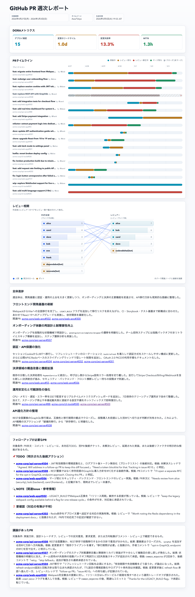

# pr-weekly-report

GitHub の Pull Request を集計し、定量メトリクスと AI 分析を組み合わせた静的 HTML レポートを生成します。
GitHub Actions で週次実行し、GitHub Pages に自動デプロイできます。

デモページ:
https://gyvm.github.io/pr-weekly-report/demo/reports/2026-05-03.html

<details>
<summary>全体のスクリーンショット</summary>



</details>

## クイックスタート

### 1. fork & clone

このリポジトリを fork して、自分の手元に clone します。

```bash
git clone https://github.com/<your-org>/pr-weekly-report.git && cd pr-weekly-report && npm install
```

### 2. 個人アクセストークン (PAT) を発行する

このツールでは用途の異なる 2 つの Fine-grained PAT を使います。

| 環境変数 | 用途 |
|---|---|
| `GITHUB_TOKEN` | PR データ取得 (GraphQL) |
| `COPILOT_GITHUB_TOKEN` | AI 分析 (Copilot SDK) |

本来は 1 つの PAT にまとめたいところですが、組織所有 (organization-owned) の Fine-grained PAT では `Copilot Requests` 権限が UI に出ない既知の制約 ([github/copilot-cli#223](https://github.com/github/copilot-cli/issues/223)) があるため、現状は 2 つに分けています。今後改善するかもしれません。

#### 2-1. `GITHUB_TOKEN` (PR 取得用)

1. https://github.com/settings/personal-access-tokens/new を開く
2. **Token name** を設定 (例: `pr-weekly-report-fetch`)
3. **Repository access** で対象リポジトリを選択
4. **Permissions > Repository permissions** で **Pull requests** を **Read-only** に設定
5. 生成された `github_pat_...` をコピー

#### 2-2. `COPILOT_GITHUB_TOKEN` (AI 分析用)

1. https://github.com/settings/personal-access-tokens/new を開く
2. **Token name** を設定 (例: `pr-weekly-report-copilot`)
3. **Resource owner** は自分のユーザーアカウントを選択
4. **Repository access** は **Public Repositories (read-only)** で十分
5. **Permissions > Account permissions** で **Copilot Requests** を **Read-only** に設定
6. 生成された `github_pat_...` をコピー

> ローカルで `copilot` CLI のセッションを使って動作確認するだけなら `COPILOT_GITHUB_TOKEN` は省略可能です(後述の手順 5 を参照)。CI 等の非対話環境で AI 分析を回す場合は必須になります。

### 3. `config.toml` を編集する

リポジトリルートの `config.toml` で対象リポジトリを書き換えます。

```toml
[general]
timezone = "Asia/Tokyo"

# 各エントリは "owner/name" または "owner/*"。
# "owner/*" は archived を除く owner 配下の全リポジトリに展開されます
# (トークンに権限があれば private も含む)。
[repositories]
include = [
  "your-org/your-repo",
  "your-org/another-repo",
  # "your-org/*",
]
```

詳しい設定項目は [設定 (`config.toml`)](#設定-configtoml) を参照。

### 4. 動作確認

まずは AI 分析を抜いて(Copilot セッション不要)動作確認します。

```bash
GITHUB_TOKEN=github_pat_... npm run report -- --skip-ai
```

成功すると以下が生成されます:

- `data/raw/<period>.json` — 取得した PR の生データ
- `data/analysis/<period>/*.{json,md}` — 各分析の出力
- `dist/reports/<period>.html` — 1 週分の HTML レポート
- `dist/index.html` — 全期間のインデックスページ

### 5. AI 分析込みで実行する

GitHub Copilot にローカルでログインしてから `--skip-ai` を外して実行します。

```bash
GITHUB_TOKEN=github_pat_... \
COPILOT_GITHUB_TOKEN=github_pat_... \
npm run report
```

### サンプルデータで試す

リポジトリには `data/demo/2026-05-03.json` というサンプル raw データが同梱されています。GitHub に問い合わせずにレポート生成を試したい場合に使えます。

```bash
npm run demo
```

## 設定 (`config.toml`)

設定はすべて TOML テーブル (`[セクション名]`) に属し、トップレベルに裸の key=value は置きません。`[repositories]` のみ必須で、他テーブルは省略可。省略時はコード側のデフォルトが適用されます。

| セクション | キー | 説明 |
|---|---|---|
| `[general]` | `timezone` | 週境界を計算するタイムゾーン (例: `Asia/Tokyo`)。省略時は `UTC` |
| `[repositories]` | `include` | 対象リポジトリの配列。各要素は `"owner/name"` または `"owner/*"` (ワイルドカードは archived を除く owner 配下の全リポジトリに展開) |
| `[limits]` | `maxPrs` / `maxCommentsPerPr` / `maxReviewThreadsPerPr` / `maxFilesPerPr` / `maxCommitsPerPr` / `maxBodyLength` | 1 PR あたりの取得上限。GraphQL のページング負荷を抑える |
| `[bots]` | `patterns` | bot と見なす GitHub login の正規表現配列。大文字小文字は区別しない |
| `[ai]` | `model` | AI 分析で使う Copilot SDK のモデル ID。省略時は SDK のデフォルト |

`skills/` 配下の AI skill と `src/pipeline/stages/analyze.ts` の `COMPUTE_REGISTRY` に登録された compute 分析は常に既定パラメータで実行されます。

利用可能な Copilot モデル ID は `copilot` CLI 内で `/model` を実行するか、Copilot SDK の `client.listModels()` で確認できます。

## 環境変数

### 認証

| 変数 | 説明 |
|---|---|
| `GITHUB_TOKEN` | Pull request の read-only 権限がある PAT |
| `COPILOT_GITHUB_TOKEN` | AI 分析専用の PAT |

## CLI

| コマンド | 役割 |
|---|---|
| `npm run collect` | PR データ取得のみ。`data/raw/<period>.json` を書く |
| `npm run report` | fetch → analyze → render の全体パイプライン |
| `npm run demo` | 同梱サンプル raw データ (`data/demo/`) でレポート生成 |

`npm run report` の主なフラグ:

| フラグ | 説明 |
|---|---|
| `--config <path>` | `config.toml` の場所 |
| `--raw-dir <path>` | 生 PR データの出力先 |
| `--analysis-dir <path>` | 分析結果の出力先 |
| `--reports-dir <path>` | HTML レポートの出力先 |
| `--index <path>` | インデックス HTML の出力先 |
| `--skills <path>` | AI skill のルートディレクトリ |
| `--week YYYY-MM-DD` | 対象週に含まれる日付。指定週(月曜始まり)を集計 |
| `--use-raw <path>` | 既存の raw snapshot を再利用し fetch をスキップ。analyze + render のみ走る |
| `--skip-ai` | AI skill を全部 `skipped` 扱いにする (Copilot 不要) |

## skill を追加して分析項目を追加する

1. `skills/<NN>_<id>/SKILL.md` を新規作成 (ディレクトリ名がそのまま分析 ID になる)。先頭の `NN_` プレフィックスで AI セクション内の表示順が決まる (`01_`, `02_`, ... 昇順)
2. YAML frontmatter の `name` はディレクトリ名と完全に一致させる (例: `name: 04_my-analysis`)。Copilot SDK はこの `name` でスキルを識別する
3. 本文に Markdown プロンプトを書く。**出力先頭の `## ...` セクション見出しはプロンプト本文にハードコードする** (例: `先頭は必ず "## 議論があったPR" にする`)
4. これだけで自動発見される (`skills/` を `discoverAiSkillIds()` がスキャンしてディレクトリ名でソート)

最小例:

```markdown
---
name: 04_my-analysis
description: 何を分析する skill かの 1 行説明
---

PR データを参照し、〜の観点で日本語のセクションを出力してください。

出力:
- 先頭は必ず `## 〜〜のサマリ` にする
- ...
```

既存実例: `skills/01_project-progress/SKILL.md`、`skills/02_follow-up-prs/SKILL.md`、`skills/03_debated-prs/SKILL.md`。


## GitHub Actions による週次自動デプロイ

`.github/workflows/weekly.yml` が毎週月曜 00:00 UTC に走り、PR データを集めて `data/` をコミットし、HTML を GitHub Pages にデプロイします。`COPILOT_GITHUB_TOKEN` secret を設定していれば AI 分析も CI 上で実行されます。未設定の場合は自動的に `--skip-ai` にフォールバックし、AI 分析セクションは `skipped` になります。

### Secrets を設定

リポジトリの **Settings > Secrets and variables > Actions** で以下を追加します。GitHub Actions では `GITHUB_TOKEN` という名前の secret を作成できないため、PR 取得用 PAT は `GH_INSIGHTS_TOKEN` として登録し、ワークフロー内で環境変数 `GITHUB_TOKEN` にマップしています。

| Secret | 説明 |
|---|---|
| `GH_INSIGHTS_TOKEN` | Pull request の read-only 権限がある PAT。env の `GITHUB_TOKEN` として渡される |
| `COPILOT_GITHUB_TOKEN` | AI 分析専用の PAT (任意)。未設定なら `--skip-ai` に自動フォールバックし AI 分析セクションは `skipped` になる |

### Pages を有効化

1. **Settings > Pages**
2. **Source** で **GitHub Actions** を選択

ワークフロー実行後、`https://<owner>.github.io/<repo>/` でレポートが見られます。
