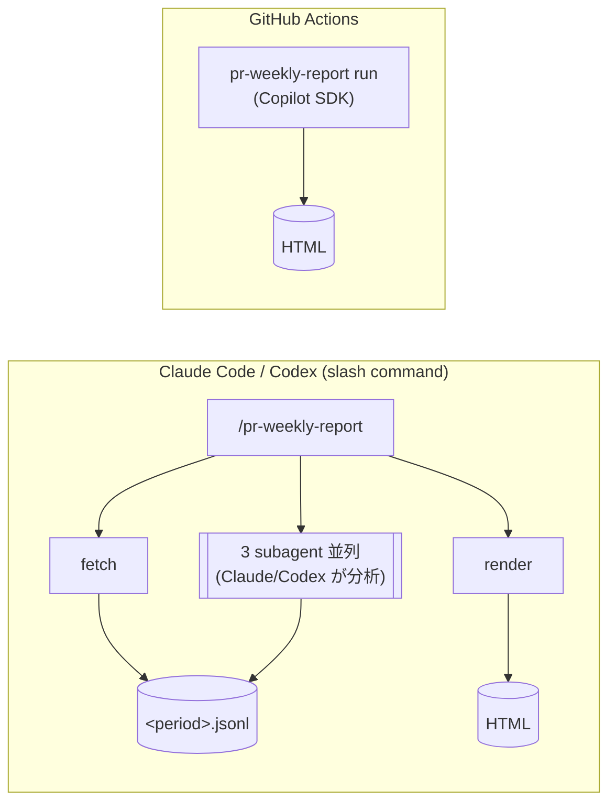

# pr-weekly-report

GitHub の Pull Request を集計し、定量メトリクスと AI 分析を組み合わせた静的 HTML レポートを生成します。
GitHub Actions で週次実行し、GitHub Pages に自動デプロイできます。

デモページ:
https://gyvm.github.io/pr-weekly-report/demo/reports/2026-05-03.html

<details>
<summary>全体のスクリーンショット</summary>


</details>

## 使い方

このツールは2通りで使えます:

- **Composite Action として** (`uses: gyvm/pr-weekly-report@v1`) — 自分のリポジトリの GitHub Actions ワークフローから呼び出す。fork やコピーは不要
- **ローカル CLI として** — fork して `npm run report` で対話的に試す・カスタマイズする

### A. GitHub Actions で使う (推奨)

利用側リポジトリに `.github/workflows/weekly.yml` を作成します:

```yaml
name: Weekly Report
on:
  schedule:
    - cron: "0 0 * * 1"
  workflow_dispatch:

permissions:
  contents: write
  pages: write
  id-token: write

concurrency:
  group: pr-weekly-report
  cancel-in-progress: false

jobs:
  report:
    runs-on: ubuntu-latest
    steps:
      - uses: actions/checkout@v6   # 過去の dist/reports/ を保持する
      - uses: gyvm/pr-weekly-report@v1
        with:
          repositories: "your-org/*"            # "owner/name" / "owner/*" を空白かカンマ区切り
          timezone: "Asia/Tokyo"                # 省略時は UTC
          github-token: ${{ secrets.GH_INSIGHTS_TOKEN }}
          copilot-token: ${{ secrets.COPILOT_GITHUB_TOKEN }}  # 省略可、無ければ AI 分析は skipped
      - name: Commit generated reports
        run: |
          git config user.name "github-actions[bot]"
          git config user.email "41898282+github-actions[bot]@users.noreply.github.com"
          git add dist/reports/
          git diff --cached --quiet || git commit -m "report: $(date +%F)"
          git push
```

設定ファイルは不要です。対象リポジトリやタイムゾーンはすべて `with:` で渡します。

#### Action の入力 (`with:`)

| 入力 | 既定値 | 説明 |
|---|---|---|
| `repositories` | (必須) | 対象リポジトリ。`"owner/name"` / `"owner/*"` を空白かカンマ区切り |
| `timezone` | `UTC` | 週境界を計算する IANA タイムゾーン (例: `Asia/Tokyo`) |
| `model` | (なし) | AI 分析で使う Copilot SDK のモデル ID。省略時は SDK のデフォルト |
| `week` | (なし) | `YYYY-MM-DD`。対象週(月曜始まり)に含まれる任意の日付。省略時は直近の完了週 |
| `skip-ai` | `false` | `true` で AI 分析を一括スキップ |
| `github-token` | (必須) | PR 取得用 PAT。`GITHUB_TOKEN` として渡される |
| `copilot-token` | (なし) | Copilot SDK 用 PAT。未指定なら AI 分析は実行されない |

#### 履歴の永続化 (マニフェスト方式)

Action は当該週の `dist/reports/<period>.html` を生成し、`dist/reports/reports.json` に1エントリ追記するだけです。`dist/index.html` は静的なシェルで、ブラウザ側で `reports.json` を fetch して一覧を描画します。過去の HTML には触らないため、毎週のコミット差分は「新 HTML 1つ + reports.json の1行」のみになります。

利用側ワークフローは `actions/checkout@v6` で過去の `dist/reports/` を取得し、Action 実行後にコミット & プッシュしてください。同時実行で `reports.json` が壊れないよう、`concurrency:` group の設定を推奨します。

GitHub Pages にデプロイする例はこのリポジトリの [.github/workflows/weekly.yml](./.github/workflows/weekly.yml) を参照してください。

### B. ローカル CLI として使う

ローカル開発・カスタマイズ用途。fork & clone します。

```bash
git clone https://github.com/<your-org>/pr-weekly-report.git && cd pr-weekly-report && npm install
```

対象リポジトリは実行時に `--repositories` で渡します (設定ファイルは不要)。git リポジトリ内で省略した場合は origin remote から推定されます。

### 2. 個人アクセストークン (PAT) を発行する

このツールでは用途の異なる 2 つの Fine-grained PAT を使います。

| 環境変数 | 用途 |
|---|---|
| `GITHUB_TOKEN` | PR データ取得 (GraphQL) |
| `COPILOT_GITHUB_TOKEN` | AI 分析 (Copilot SDK) |

本来は 1 つの PAT にまとめたいところですが、組織所有 (organization-owned) の Fine-grained PAT では `Copilot Requests` 権限が UI に出ない既知の制約 ([github/copilot-cli#223](https://github.com/github/copilot-cli/issues/223)) があるため、現状は 2 つに分けています。今後改善するかもしれません。

#### 2-1. `GITHUB_TOKEN` (PR 取得用)

1. https://github.com/settings/personal-access-tokens/new を開く
2. **Token name** を設定 (例: `pr-weekly-report-fetch`)
3. **Repository access** で対象リポジトリを選択
4. **Permissions > Repository permissions** で **Pull requests** を **Read-only** に設定
5. 生成された `github_pat_...` をコピー

#### 2-2. `COPILOT_GITHUB_TOKEN` (AI 分析用)

1. https://github.com/settings/personal-access-tokens/new を開く
2. **Token name** を設定 (例: `pr-weekly-report-copilot`)
3. **Resource owner** は自分のユーザーアカウントを選択
4. **Repository access** は **Public Repositories (read-only)** で十分
5. **Permissions > Account permissions** で **Copilot Requests** を **Read-only** に設定
6. 生成された `github_pat_...` をコピー

> ローカルで `copilot` CLI のセッションを使って動作確認するだけなら `COPILOT_GITHUB_TOKEN` は省略可能です(後述の手順 5 を参照)。CI 等の非対話環境で AI 分析を回す場合は必須になります。

### 3. 対象リポジトリを決める

実行時に `--repositories` で渡します。各エントリは `"owner/name"` または `"owner/*"`、空白かカンマ区切りで複数指定できます。`"owner/*"` は archived を除く owner 配下の全リポジトリに展開されます (トークンに権限があれば private も含む)。git リポジトリ内で省略した場合は origin remote から1件推定されます。

詳しい指定方法は [設定](#設定) を参照。

### 4. 動作確認

まずは AI 分析を抜いて(Copilot セッション不要)動作確認します。

```bash
GITHUB_TOKEN=github_pat_... npm run report -- --skip-ai --repositories "your-org/*"
```

成功すると以下が生成されます:

- `data/<period>.jsonl` — その週を再生成するために必要な全データ (meta + PR + 分析結果) が1ファイルにまとまった中間表現。週ごとに自己完結し、コミットして履歴に残せる
- `dist/reports/<period>.html` — 1 週分の HTML レポート
- `dist/reports/reports.json` — 全期間のマニフェスト (新しい順に追記)
- `dist/index.html` — マニフェストを fetch して一覧表示する静的シェル (初回のみ生成)

JSONL が手元にあれば、`--from-jsonl data/<period>.jsonl` を指定して HTML だけ再生成できます (GitHub API も Copilot SDK も呼ばれません)。

### 5. AI 分析込みで実行する

GitHub Copilot にローカルでログインしてから `--skip-ai` を外して実行します。

```bash
GITHUB_TOKEN=github_pat_... \
COPILOT_GITHUB_TOKEN=github_pat_... \
npm run report -- --repositories "your-org/*"
```

## 設定

設定ファイル (config.toml) はありません。よく使う設定は CLI フラグ / Action の `with:` 入力で渡し、めったに変えない構造化設定 (取得上限・bot 判定) はコードに焼き込んでいます。AI skill と `COMPUTE_REGISTRY` の compute 分析は常に既定で全て実行されます。

| 設定 | 渡し方 | 既定 |
|---|---|---|
| 対象リポジトリ | CLI `--repositories` / Action `repositories` 入力 (`"owner/name"` / `"owner/*"` を空白・カンマ区切り) | git remote から推定 |
| タイムゾーン | CLI `--timezone` / Action `timezone` 入力 (週境界の IANA TZ) | `UTC` |
| AI モデル | CLI `--model` / Action `model` 入力 (Copilot SDK のモデル ID) | SDK のデフォルト |

`"owner/*"` は archived を除く owner 配下の全リポジトリに展開されます (トークンに権限があれば private も含む)。git リポジトリ内で `--repositories` を省略すると、origin remote から1件だけ推定されます。

利用可能な Copilot モデル ID は `copilot` CLI 内で `/model` を実行するか、Copilot SDK の `client.listModels()` で確認できます。

### ハードコードされた設定

以下は `src/shared/config.ts` の定数で、実行時には変更できません (必要になれば将来フラグ化します)。

- **取得上限** (`DEFAULT_LIMITS`): 1 PR あたりの comments / review threads / files / commits 取得数と本文長の上限。GraphQL のページング負荷を抑える。
- **bot 判定** (`DEFAULT_BOT_PATTERNS`): `…[bot]` 接尾辞や `dependabot` / `renovate` / `github-actions` / `copilot` を bot と見なす正規表現。

## 環境変数

### 認証

| 変数 | 説明 |
|---|---|
| `GITHUB_TOKEN` | Pull request の read-only 権限がある PAT |
| `COPILOT_GITHUB_TOKEN` | AI 分析専用の PAT |

## CLI

開発時は `npm run report -- <flags>` (tsx 経由)。配布バンドル経由なら `npx pr-weekly-report <flags>` または `node dist/cli.js <flags>`。いずれも `src/cli/report.ts` を起点とする同じ実装です。

### Subcommands

CLI は以下の subcommand 構造をとります。最初の引数が subcommand 名 (未指定なら `run`)。

| Subcommand | 概要 | LLM |
|---|---|---|
| `run` | 全工程 (fetch → AI 分析 → render) を Copilot SDK で実行 | Copilot |
| `fetch` | GraphQL fetch + compute 分析を実行し JSONL を書き出す | なし |
| `list-skills` | AI skill ID 一覧を 1 行ずつ出力 | なし |
| `analyze --skill <id>` | 指定 skill の入力 JSON を stdout に出す (LLM への入力プロビジョン) | なし |
| `analyze --skill <id> --write <p\|->` | LLM が生成した Markdown を JSONL に書き戻す | なし |
| `render` | JSONL から HTML / manifest / JSONL コピーを出力 | なし |

slash command / subagent からは fetch → analyze (read) → analyze (write) → render を組み合わせて使います ([Claude Code / Codex slash command](#claude-code--codex-slash-command-で使う) を参照)。

### 主なフラグ

| フラグ | 説明 |
|---|---|
| `--repositories <s>` | 対象リポジトリ。`"owner/name"` / `"owner/*"` を空白かカンマ区切り (run/fetch で必須。省略時は git remote から推定) |
| `--timezone <tz>` | 週境界の IANA タイムゾーン (既定: `UTC`) |
| `--model <id>` | AI 分析の Copilot モデル ID (任意) |
| `--data-dir <path>` | JSONL 中間表現の出力先 (既定: `data/`) |
| `--reports-dir <path>` | HTML レポートの出力先 |
| `--index <path>` | インデックス HTML の出力先 |
| `--skills <path>` | AI skill のルートディレクトリ |
| `--week YYYY-MM-DD` | 対象週に含まれる日付。指定週(月曜始まり)を集計 |
| `--from-jsonl <path>` | 既存 JSONL を読み込む (analyze / render) |
| `--skill <id>` | analyze 用の skill ID |
| `--write <path\|->` | analyze で Markdown を書き戻す。`-` で stdin |
| `--skip-ai` | `run` でのみ有効。AI 分析を全部 `skipped` 扱いにする |

## Claude Code / Codex slash command で使う

このリポジトリは Claude Code plugin として読み込めます。インストール後、`/pr-weekly-report [YYYY-MM-DD]` を打つと:

1. `fetch` で当該週の PR を取得し JSONL を生成
2. `agents/pr-<skill>.md` の各 subagent を **並列** に発火 (Claude/Codex 自身が AI 分析を担当)
3. `render` で HTML / JSONL / manifest を出力

```bash
# Claude Code: plugin としてインストール
/plugin install gyvm/pr-weekly-report

# 実行
/pr-weekly-report 2026-05-11
```

Codex でも `.codex/prompts/pr-weekly-report.md` + `.codex/agents/pr-*.md` で同等の動作を提供します。GitHub Actions の Copilot SDK 経路、Claude Code 経路、Codex 経路の 3 つは同じ `skills/*/SKILL.md` を共有しており、AI 実行主体だけが入れ替わります。



## skill を追加して分析項目を追加する

1. `skills/<id>/SKILL.md` を新規作成 (ディレクトリ名はそのまま分析 ID になる。kebab-case)
2. YAML frontmatter の `name` はディレクトリ名と一致させる。`order: <整数>` で表示順を制御する (昇順)。Copilot SDK / Claude / Codex のいずれも `name` で skill を識別する
3. 本文に Markdown プロンプトを書く。**出力先頭の `## ...` セクション見出しはプロンプト本文にハードコードする**
4. これだけで自動発見される (`skills/` を `discoverAiSkillIds()` がスキャンし `order` でソート)
5. Claude Code / Codex 経路で使う場合は、対応する subagent (`agents/pr-<id>.md` / `.codex/agents/pr-<id>.md`) も追加すること

最小例:

```markdown
---
name: my-analysis
description: 何を分析する skill かの 1 行説明
order: 4
---

PR データを参照し、〜の観点で日本語のセクションを出力してください。

出力:
- 先頭は必ず `## 〜〜のサマリ` にする
- ...
```

既存実例: `skills/project-progress/SKILL.md`、`skills/follow-up-prs/SKILL.md`、`skills/debated-prs/SKILL.md`。


## Secrets と GitHub Pages

### Secrets を設定

利用側リポジトリの **Settings > Secrets and variables > Actions** で以下を追加します。GitHub Actions では `GITHUB_TOKEN` という名前の secret を作成できないため、PR 取得用 PAT は `GH_INSIGHTS_TOKEN` として登録します。

| Secret | 説明 |
|---|---|
| `GH_INSIGHTS_TOKEN` | Pull request の read-only 権限がある PAT。Action の `github-token` 入力に渡す |
| `COPILOT_GITHUB_TOKEN` | AI 分析専用の PAT (任意)。未設定なら AI 分析セクションは `skipped` になる |

### Pages を有効化

1. **Settings > Pages**
2. **Source** で **GitHub Actions** を選択

ワークフロー実行後、`https://<owner>.github.io/<repo>/` でレポートが見られます。このリポジトリ自身も同じ Action を呼んでおり、生成例は [.github/workflows/weekly.yml](./.github/workflows/weekly.yml) を参照してください。
