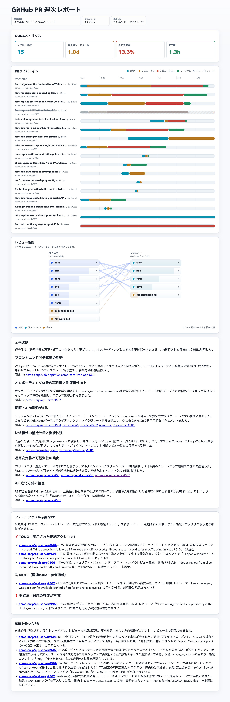

# Dev Prism

GitHub の Pull Request を集計し、リードタイムを入口にチームの開発フローを映し出す
週次振り返りレポートを生成します。定量メトリクス (DORA / レビュー相関 / PR タイムライン) と
AI 分析を組み合わせ、週次MTGで変化理由・拾うべきPR・フォローアップ候補を確認できます。

デモページ:
https://gyvm.github.io/dev-prism/demo/reports/2026-05-03.html

<details>
<summary>全体のスクリーンショット</summary>



</details>

## 仕組み

3 つの関心事に分かれています。導入パターンの違いは「どこで実行し、どこに配信するか」だけで、
中身のパイプラインは共通です。

| レイヤ | 実体 | 補足 |
|---|---|---|
| **データ** | `data/dwh/` の DuckDB parquet (DWH) | 真実の源。`updated_at` から収集カーソルを自己復元する増分収集 |
| **サイト** | Astro 6 + React islands → `dist/` | Reports ギャラリーは SSG、Explore は DuckDB-WASM で parquet をライブクエリ |
| **AI 分析** | GitHub Copilot SDK + `skills/` の prompt | 任意。トークン未設定なら自動で `--skip-ai` にフォールバック |

## 導入パターン早見表

| パターン | 実行環境 | 配信先 | 向いているケース |
|---|---|---|---|
| **A. ローカル** | 手元の Node | ローカルの `dist/` を開く | まず試す / 単発で見たい |
| **B. GitHub Actions + ホスティング** | GitHub-hosted runner | GitHub Pages / Cloudflare 等 | **推奨。** 週次自動化を最小手間で回したい |

> **迷ったら B。** GitHub Actions はホスト型 cron・無料の Pages 配信・`GITHUB_API_URL`
> 自動注入・secret 管理をタダで提供します。A は単発で中身を確認したいときに使ってください。

---

## 認証 (全パターン共通)

このツールは用途の異なる 2 つの Fine-grained PAT を使います (GitHub App でも可、後述)。

| 環境変数 | 用途 |
|---|---|
| `GITHUB_TOKEN` | PR データ取得 (GraphQL) |
| `COPILOT_GITHUB_TOKEN` | AI 分析 (Copilot SDK)。任意 |

本来は 1 つにまとめたいところですが、組織所有 (organization-owned) の Fine-grained PAT では
`Copilot Requests` 権限が UI に出ない既知の制約
([github/copilot-cli#223](https://github.com/github/copilot-cli/issues/223)) があるため、現状は分けています。

### `GITHUB_TOKEN` (PR 取得用)

1. https://github.com/settings/personal-access-tokens/new を開く
2. **Token name** を設定 (例: `dev-prism-fetch`)
3. **Repository access** で対象リポジトリを選択
4. **Permissions > Repository permissions** で **Pull requests** を **Read-only** に設定
5. 生成された `github_pat_...` をコピー

### `COPILOT_GITHUB_TOKEN` (AI 分析用・任意)

1. https://github.com/settings/personal-access-tokens/new を開く
2. **Token name** を設定 (例: `dev-prism-copilot`)
3. **Resource owner** は自分のユーザーアカウントを選択
4. **Repository access** は **Public Repositories (read-only)** で十分
5. **Permissions > Account permissions** で **Copilot Requests** を **Read-only** に設定
6. 生成された `github_pat_...` をコピー

> ローカルで `copilot` CLI のセッションを使って動作確認するだけなら `COPILOT_GITHUB_TOKEN` は
> 省略可能です (パターン A の手順参照)。CI 等の非対話環境で AI 分析を回す場合は必須です。

### GitHub App 認証 (代替)

`GITHUB_TOKEN` の代わりに GitHub App の 3 点セットでも認証できます。多数の組織・リポジトリを
跨ぐ場合に有効です。3 つ揃っていれば installation token を自動発行します。

| 環境変数 | 説明 |
|---|---|
| `GITHUB_APP_ID` | App ID |
| `GITHUB_APP_PRIVATE_KEY` | App の秘密鍵 (PEM) |
| `GITHUB_APP_INSTALLATION_ID` | インストール ID |

---

## パターン A: ローカル

### 1. clone & install

```bash
git clone https://github.com/<your-org>/dev-prism.git
cd dev-prism
npm install
```

### 2. `config.toml` を編集

```toml
[general]
timezone = "Asia/Tokyo"

# 各エントリは "owner/name" または "owner/*"。
# "owner/*" は archived を除く owner 配下の全リポジトリに展開されます
# (トークンに権限があれば private も含む)。
[repositories]
include = [
  "your-org/your-repo",
  # "your-org/*",
]
```

詳しい設定項目は [設定 (`config.toml`)](#設定-configtoml) を参照。

### 3. 動作確認 (AI 抜き)

まずは AI 分析を抜いて (Copilot セッション不要) 動かします。

```bash
GITHUB_TOKEN=github_pat_... npm run report -- --skip-ai
```

成功すると以下が生成されます:

- `data/raw/<period>.json` — 取得した PR の生データ
- `data/analysis/<period>/*.{json,md}` — 各分析の出力
- `dist/reports/<period>.html` — 1 週分の HTML レポート
- `dist/index.html` — 全期間のインデックスページ

### 4. AI 分析込みで実行

GitHub Copilot にローカルでログインしてから `--skip-ai` を外します。

```bash
GITHUB_TOKEN=github_pat_... \
COPILOT_GITHUB_TOKEN=github_pat_... \
npm run report
```

### サンプルデータで試す

GitHub に問い合わせず試したい場合は同梱サンプル (`data/demo/2026-05-03.json`) を使えます。

```bash
npm run demo
```

### Explore も含めたローカル全ビルド

DWH ベースのフルスタック (Explore + ギャラリー) をローカルで組む場合:

```bash
rm -rf dist
GITHUB_TOKEN="$(gh auth token)" npx tsx src/cli/dwh-build.ts --config config.toml --dwh-dir /tmp/dwh
npm run explore:data -- --dwh-dir /tmp/dwh                                  # Explore 用 parquet 8表 → dist/data
npm run report:dwh -- --dwh-dir /tmp/dwh --reports-dir dist/reports --from 2026-04-01 --to 2026-05-18
npm run web:build                                                           # 一覧 SSG + Explore 島 + nav.js → dist/
```

開発サーバは `npm run web:dev` (`http://localhost:4321/`)。

---

## パターン B: GitHub Actions + ホスティング (推奨)

エンジン本体を **1 つの GitHub Action** として参照し、利用側 (consumer) リポジトリは
**設定と蓄積データだけ**を持ちます。

| Action | 種類 | 役割 |
|---|---|---|
| `your-org/dev-prism@v0` | composite | PR 収集 → `data/dwh` (parquet) を増分更新 → そのまま Explore + Reports サイトを `dist/` にビルド |

> 収集とサイトビルドは 1 アクション・1 回の `npm ci` で連続実行します。consumer は
> 「checkout → action → `data/dwh` を commit → Pages へ deploy」だけの最小ワークフローになります。

### テンプレートから始める (最短)

すぐ使えるテンプレートを [`template/`](template/) に用意しています — `config.toml` +
ワークフロー (collect → commit `data/dwh` → site build → Pages deploy) + README。

1. `template/` を新しいリポジトリにコピー (または GitHub の "template repository" にして *Use this template*)
2. `.github/workflows/dashboard.yml` の `__OWNER__/__REPO__` を参照するエンジンに置換:
   ```bash
   sed -i '' 's#__OWNER__/__REPO__#your-org/dev-prism#g' .github/workflows/dashboard.yml
   # Linux (GNU sed) は空バックアップ引数不要: sed -i 's#...#...#g' ...
   ```
3. `config.toml` の `[repositories].include` を対象リポジトリに設定
4. **Settings > Secrets and variables > Actions** で `DEV_PRISM_GH_TOKEN` を追加
   (read-only PAT。ワークフローはこれを Action の `github-token` 入力に渡します)
5. **Settings > Pages > Source** を **GitHub Actions** に
6. **Actions > PR Dashboard > Run workflow** で初回実行 (初回は `from` で過去分を backfill 可)

ダッシュボードは `https://<owner>.github.io/<repo>/` に公開されます。

### ホスティング先別の `base`

Action の `base` (Astro base path) をホスティングに合わせます。

| ホスティング | `base` |
|---|---|
| GitHub Pages (project page) | `/<repo>/` |
| 独自ドメイン / Cloudflare Pages | `/` |

Cloudflare 等に出す場合は、Pages deploy ステップの代わりにビルド済み `dist/` を
その static host に向けてください。

### Action の要点

composite Action 1 本で、収集 → DWH 更新 → サイトビルドを順に実行します。`action.yml` は
エンジンリポジトリのルートにあるため `${{ github.action_path }}` がエンジンの checkout 全体を
指し、`npm ci` ・`src/web` ・リポジトリルートの `dist/` がそこから解決されます。

- **入力**:
  - `config` (既定 `config.toml`) / `dwh-dir` (既定 `data/dwh`) / `from` (任意・過去分 backfill)
  - `base` (Astro base path。Pages project page は `/<repo>/`、独自ドメイン/Cloudflare は `/`)
  - `output-dir` (既定 `dist`) / `site` (任意・canonical URL) / `reports-config` (任意・指定すると
    frozen reports で gallery を生成)
  - `github-token` (PR 取得用の read-only PAT)
- **認証**: read-only PAT は **`github-token` 入力**で渡す (`with: github-token: ${{ secrets.... }}`)。
  composite アクションは **呼び出し `uses:` step の `env:` を内部 run step に伝播しない**ため、
  env ではなく入力で渡す。GitHub App 認証を使う場合は `GITHUB_APP_ID` /
  `GITHUB_APP_PRIVATE_KEY` / `GITHUB_APP_INSTALLATION_ID` を **job/workflow レベルの `env:`** に置く
  (こちらは composite と共有される)。GHES では `GITHUB_API_URL` / `GITHUB_GRAPHQL_URL` が自動で渡る
- **進捗ログ**: 各フェーズ (`npm ci` / 収集 / Explore データ配置 / astro build / dist 書き出し) を
  `::group::` でグルーピングし、節目に `::notice::` を出すので Actions ログで進行が追える
- **レート制限時**: 収集は取得済み分を書き込んだうえで **exit 1 で fail loudly** し、stderr に reset 時刻を出す
  (CI を緑にして取りこぼしを隠さないため)。書き込んだ分は安全に残り、次回実行で DWH カーソルが自動的に続きから再開する

### AI 分析を CI で回す

`COPILOT_GITHUB_TOKEN` secret を設定していれば AI 分析も CI 上で実行されます。未設定の場合は
自動的に `--skip-ai` にフォールバックし、AI 分析セクションは `skipped` になります。

---

## セキュリティとネットワーク境界

Dev Prism は PR 本文・レビューコメント・アカウント名を扱うため、「どこへ通信するのか」が
導入判断の最初の関門になります。ここでは **通信先の全量** と、**利用者側でそれを強制する方法**を
示します。

### Dev Prism が必要とする通信先

Action 実行中に発生しうる外向き通信は以下がすべてです。

| 通信先 | いつ | 必須 |
|---|---|---|
| `registry.npmjs.org:443` | `npm ci` (エンジンの依存インストール) | ✅ |
| `github.com:443` / `codeload.github.com:443` | `actions/checkout`、Node ランタイム取得 | ✅ |
| `raw.githubusercontent.com:443` / `objects.githubusercontent.com:443` / `nodejs.org:443` | `setup-node` のバージョン manifest と Node 本体 | ✅ |
| `api.github.com:443` | PR の収集 (REST + GraphQL) | ✅ |
| `GITHUB_API_URL` / `GITHUB_GRAPHQL_URL` のホスト | GHES 利用時の収集先 (ランナーが自動注入) | GHES 時のみ |
| Copilot API | AI 分析 | ⬜ **任意** |

**外部にデータが出る経路は AI 分析だけ**です。`COPILOT_GITHUB_TOKEN` が未設定なら自動的に
`--skip-ai` にフォールバックし、Copilot への通信は一切発生しません
([AI 分析を CI で回す](#ai-分析を-ci-で回す))。収集した PR データの保存先は実行環境の
`dwh-dir` (既定 `data/dwh`) のみで、外部ストレージには送りません。

### 利用者側で egress を強制する

上の表を信用する必要はありません。**Dev Prism 側に手を入れずに、呼び出し側のワークフローだけで
通信先を強制できます。** [`step-security/harden-runner`](https://github.com/step-security/harden-runner) を
**ジョブの最初のステップ**に置くと、runner VM 上でエージェントが常駐し、以降の同一ジョブの
全プロセス — `uses: your-org/dev-prism` の内部で走る `npm ci` や、その依存の postinstall まで —
が allowlist の外に出られなくなります。

```yaml
jobs:
  report:
    runs-on: ubuntu-latest
    steps:
      # 必ず最初に置く。これ以降のステップがすべて対象になる
      - uses: step-security/harden-runner@bf7454d06d71f1098171f2acdf0cd4708d7b5920 # v2.20.0
        with:
          egress-policy: block
          allowed-endpoints: >
            api.github.com:443
            codeload.github.com:443
            github.com:443
            nodejs.org:443
            objects.githubusercontent.com:443
            raw.githubusercontent.com:443
            registry.npmjs.org:443

      - uses: actions/checkout@v4
      - uses: your-org/dev-prism@v0     # ← この中の通信も上の allowlist に縛られる
        with:
          config: config.toml
          base: /<repo>/
          github-token: ${{ secrets.DEV_PRISM_GH_TOKEN }}
```

AI 分析を使う場合のみ、初回を `egress-policy: audit` で回して Copilot のエンドポイントを
確認し、allowlist に追加してください。**AI を使わないなら上のリストのままで動きます。**

Pages へデプロイするステップを同じジョブに置く場合は
`*.actions.githubusercontent.com:443` の追加が必要になることがあります。収集ジョブと
デプロイジョブを分けておくと、収集側の allowlist を最小に保てます。

### この一覧は CI で検証されています

上の表は口約束ではありません。本リポジトリの `verify.yml` は **`egress-policy: block` と
まったく同じ allowlist** で毎 PR の E2E を回しています。Dev Prism が表にないホストへ
通信し始めた時点で CI が赤くなるため、**表と実装の乖離が検出される**仕組みです。

同時にこれは「**AI 無効時に AI へ通信しない**」の実証にもなっています。`verify.yml` の
allowlist には Copilot 系エンドポイントが一切含まれておらず、`COPILOT_GITHUB_TOKEN` も
設定していません。この状態で E2E が緑になること自体が、AI 無効時の通信ゼロの証拠です。

### 制約と限界 (正直な注記)

- **block モードは GitHub-hosted の Linux ランナーのみ。** Windows / macOS は audit のみ。
  また `container:` を使うジョブでは動作しません (下地 VM の sudo が必要なため)
- **harden-runner 自体がサードパーティのエージェント**です。信頼点が 1 つ増えるので、上の例の
  ように必ず commit SHA でピンしてください。過去に DNS-over-HTTPS を使った egress フィルタの
  バイパスが報告されています (v2.16.0 で修正済み。上記の例は v2.20.0)
- **より強い層**として、GitHub が runner VM の外側・L7 で動く
  [ネイティブ egress firewall](https://github.com/github-early-access/actions-native-egress-firewall)
  を early access で提供しています (`runs-on: ubuntu-24.04-firewall`)。VM 内で root を取られても
  回避できないため、GA したらこちらへの移行が望ましい構成です。エンタープライズなら
  Azure private networking + NSG の outbound ルールでも同等の制御ができます
- Dev Prism の Action が **composite である**ことがこの制御の前提です (ランナー上で直接プロセスが
  走るため harden-runner の監視対象になる)

---

## 設定 (`config.toml`)

設定はすべて TOML テーブル (`[セクション名]`) に属し、トップレベルに裸の key=value は置きません。
`[repositories]` のみ必須で、他テーブルは省略可。省略時はコード側のデフォルトが適用されます。

| セクション | キー | 説明 |
|---|---|---|
| `[general]` | `timezone` | 週境界を計算するタイムゾーン (例: `Asia/Tokyo`)。省略時は `UTC` |
| `[repositories]` | `include` | 対象リポジトリの配列。各要素は `"owner/name"` または `"owner/*"` (ワイルドカードは archived を除く owner 配下の全リポジトリに展開) |
| `[limits]` | `maxPrs` / `maxCommentsPerPr` / `maxReviewThreadsPerPr` / `maxFilesPerPr` / `maxCommitsPerPr` / `maxBodyLength` | 1 PR あたりの取得上限。GraphQL のページング負荷を抑える |
| `[bots]` | `patterns` | bot と見なす GitHub login の正規表現配列。大文字小文字は区別しない |
| `[ai]` | `model` | AI 分析で使う Copilot SDK のモデル ID。省略時は SDK のデフォルト |

`skills/` 配下の AI skill と `src/pipeline/stages/analyze.ts` の `COMPUTE_REGISTRY` に登録された
compute 分析は常に既定パラメータで実行されます。

利用可能な Copilot モデル ID は `copilot` CLI 内で `/model` を実行するか、Copilot SDK の
`client.listModels()` で確認できます。

## 環境変数

| 変数 | 説明 |
|---|---|
| `GITHUB_TOKEN` | Pull request の read-only 権限がある PAT |
| `COPILOT_GITHUB_TOKEN` | AI 分析専用の PAT (任意) |
| `GITHUB_APP_ID` / `GITHUB_APP_PRIVATE_KEY` / `GITHUB_APP_INSTALLATION_ID` | GitHub App 認証 (PAT の代替。3 点セットで有効) |
| `LOOKBACK_DAYS` | 初回フルロードで遡る日数 (既定 `30`)。これより古い履歴は `dwh:build --from` で取得する |
| `GITHUB_GRAPHQL_URL` / `GITHUB_API_URL` | GitHub Enterprise Server 用。未設定なら github.com。GitHub Actions ランナーでは自動設定される |
| `ASTRO_BASE` / `ASTRO_SITE` | サイトの base path / canonical URL。独自ドメインやサブパス配信で使う |

## CLI

| コマンド | 役割 |
|---|---|
| `npm run collect` | PR データ取得のみ。`data/raw/<period>.json` を書く |
| `npm run report` | fetch → analyze → render の全体パイプライン (orchestrate 系) |
| `npm run dwh:build -- [--config <path>] [--dwh-dir <dir>] [--from YYYY-MM-DD]` | PR を収集して DWH (parquet) を増分構築。`--from` で過去分を backfill |
| `npm run report:dwh -- [--reports-config <path>] [--from <d> --to <d>] [--dwh-dir <dir>] [--reports-dir <dir>]` | DWH から frozen reports + `index.json` を生成 |
| `npm run explore:data -- --dwh-dir <dir>` | Explore 用の 9 Parquet を `src/web/public/data` (→ `dist/data`) へ配置。完全 DWH は変更しない |
| `npm run demo` | 同梱サンプル raw データ (`data/demo/`) でレポート生成 |

### 増分収集と backfill (`dwh:build`)

`dwh:build` の収集カーソルはコミット済み DWH の `updated_at` から自己復元する (別途の状態ファイル不要):

- **増分 (既定)**: 各 repo の `max(updated_at)` 以降のみ取得。初回は `LOOKBACK_DAYS` (既定 30 日) まで遡る。
- **backfill (`--from YYYY-MM-DD`)**: 各 repo の `min(updated_at)` を読み、**未カバーの古い範囲
  `[from, min]` だけ**取得する。指定日が既に収集済みの repo は skip。取り込みは PR 単位の冪等 upsert なので、範囲が重複しても安全。
- GitHub のレート制限に達したら、取得済み分を書き込んだうえで **exit 1 で終了する** (取りこぼしを
  隠さないため)。リセット時刻と再実行を案内し、書き込んだ分は残るのでカーソルが次回自動で続きから
  再開する。

### `npm run report` の主なフラグ

| フラグ | 説明 |
|---|---|
| `--config <path>` | `config.toml` の場所 |
| `--raw-dir <path>` | 生 PR データの出力先 |
| `--analysis-dir <path>` | 分析結果の出力先 |
| `--reports-dir <path>` | HTML レポートの出力先 |
| `--index <path>` | インデックス HTML の出力先 |
| `--skills <path>` | AI skill のルートディレクトリ |
| `--week YYYY-MM-DD` | 対象週に含まれる日付。指定週 (月曜始まり) を集計 |
| `--use-raw <path>` | 既存の raw snapshot を再利用し fetch をスキップ。analyze + render のみ走る |
| `--skip-ai` | AI skill を全部 `skipped` 扱いにする (Copilot 不要) |

## skill を追加して分析項目を追加する

1. `skills/<NN>_<id>/SKILL.md` を新規作成 (ディレクトリ名がそのまま分析 ID になる)。先頭の `NN_`
   プレフィックスで AI セクション内の表示順が決まる (`01_`, `02_`, ... 昇順)
2. YAML frontmatter の `name` はディレクトリ名と完全に一致させる (例: `name: 04_my-analysis`)。
   Copilot SDK はこの `name` でスキルを識別する
3. 本文に Markdown プロンプトを書く。**出力先頭の `## ...` セクション見出しはプロンプト本文に
   ハードコードする** (例: `先頭は必ず "## 議論があったPR" にする`)
4. これだけで自動発見される (`skills/` を `discoverAiSkillIds()` がスキャンしてディレクトリ名でソート)

最小例:

```markdown
---
name: 04_my-analysis
description: 何を分析する skill かの 1 行説明
---

PR データを参照し、〜の観点で日本語のセクションを出力してください。

出力:
- 先頭は必ず `## 〜〜のサマリ` にする
- ...
```

既存実例: `skills/01_project-progress/SKILL.md`、`skills/02_follow-up-prs/SKILL.md`、`skills/03_debated-prs/SKILL.md`。

## Web (Explore + Reports ギャラリー)

フロントは **Astro 6 + React islands** (`src/web`)。2 つのモードを共有の開閉サイドバーで行き来できます。

- **Reports ギャラリー** (`/`): `report:dwh` が出力する `dist/reports/index.json` から **ビルド時に SSG**。
  各カードは凍結レポート (`/reports/<id>.html`) へリンク。
- **Explore** (`/explore`): `client:only` の React 島。ブラウザ内 **DuckDB-WASM** が画面用に絞った
  `dist/data/*.parquet` を直接クエリし、レポートと**同一のレンダラ・SQL**で DORA / レビュー相関 /
  PR タイムラインをライブ集計。`explore:data` が置くのは画面で使う 9 テーブルだけで、完全 DWH の
  `bodies.parquet` (PR 本文・コメント本文を含む) は AI／バッチ処理向けに `data/dwh/` に残し、
  **静的サイトには配信しない**。
  期間プリセット (今週/過去1ヶ月/3ヶ月/1年) + カレンダー、repo/user の multiselect で絞り込み。
- **サイドバー**: アプリ面 (一覧/Explore) は Astro が SSR。凍結レポートには閲覧時に `nav.js` が
  オーバーレイ描画する (本文は自己完結のまま・常に最新ナビ)。

### スクリプト

| コマンド | 役割 |
|---|---|
| `npm run web:dev` | Astro 開発サーバ (base `/`、`http://localhost:4321/`) |
| `npm run web:build` | `nav.js` ビルド + `astro build` (本番 base `/dev-prism`)。**base は固定**なので、別 base で焼くときは `ASTRO_BASE=... astro build --root src/web` を直接叩く |
| `npm run explore:data -- --dwh-dir <dir>` | Explore 用の 9 Parquet を `src/web/public/data` へ配置。完全 DWH は変更しない |
| `npm run report:dwh -- --dwh-dir <dir> --reports-dir dist/reports --from <d> --to <d>` | 凍結レポート + `index.json` を生成 (`--index` は付けない: 一覧 HTML は Astro が生成) |

> **描画の更新 (デザイン変更)** は `report:dwh` を再実行すれば凍結レポートを現行レンダラで再生成できます
> (データ凍結 / 描画オンデマンド再生成)。サイドバーの更新は `nav.js` の再デプロイのみで反映され、
> レポート再生成は不要です。

## リリース (メンテナ向け)

バージョンラインは **v0** です。semver の v0 契約に従い、**minor = 機能追加 / 破壊的変更**、
**patch = バグ修正**として扱います。consumer は浮動メジャータグ **`@v0`** をピン留めするので、
リリースは利用側の次回 run で自動的に反映され、`uses:` の書き換えは不要です。

### リリース手順

1. **Actions > Release > Run workflow** を開き、`bump` (`patch` / `minor` / `major`) を選んで実行。
   - 初回リリースは `package.json` の現バージョン (現状 `0.1.0`) をそのまま `v0.1.0` として公開します
     (bump は無視)。2 回目以降は最新タグから計算します。
2. `release.yml` が `package.json` を更新 → `release: vX.Y.Z` をコミット → `vX.Y.Z` (固定) と
   `v0` (浮動・force) のタグを push。

### タグの対応関係

| 参照 | 実体 | 用途 |
|---|---|---|
| `uses: your-org/dev-prism@v0` | 浮動 git タグ。毎リリースで最新 commit へ移動 | consumer が固定する推奨参照 |
| `uses: your-org/dev-prism@v0.1.0` | 固定 git タグ | バージョン固定したい場合 |

> 安定したら `major` bump で **v1** を切り、`@v0` 利用者を `@v1` に案内します。Action は composite
> なので、consumer 側が用意するのは `uses:` の参照だけです。

> **main ブランチ保護について**: `release.yml` はタグを先に push してから bump コミットを
> `main` へ push します。`main` が保護されていてコミット push が弾かれた場合でも、タグは
> 既に push 済みなのでリリース自体は成立します (`package.json` のズレは後で通常 PR で解消)。
