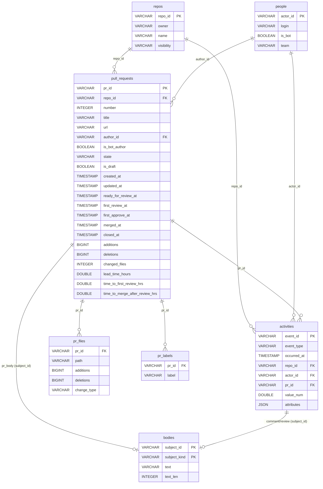

# Analytics Platform 設計

PR データを「事前にバケット集計した固定レポート」から、**DWH に貯めてブラウザ内
(DuckDB-WASM)で動的に集計・探索できるプラットフォーム**へ拡張するための設計。

- 配布モデルは「エンジン / 利用者リポジトリの分離」(fork ではなく versioned 参照)
- 探索はクライアント完全内製の DuckDB-WASM(常駐サーバー・認証基盤なし)
- 成果物は「静的ファイルの塊」なので、Pages / Cloudflare / Docker どこへでも置ける
- **DWH が source of truth**(raw スナップショットは処理中の一時データで、取り込み後に破棄)

## 全体像

データの流れは3本に集約する:**① GitHub → DWH**(取り込み)、**② DWH → Explore**(ライブ集計)、
**③ DWH → レポート作成**(凍結 HTML)。DWH が唯一の真実で、②③ はそこから派生する。

```
GitHub GraphQL
        │  ① collect(updatedAt カーソルで増分)
一時スナップショット(runner 内スクラッチ。取り込み後に破棄)
        │  build: upsert(冪等)
DWH (Parquet, star schema)  ← source of truth。永続。今回作る唯一のスキーマ
        ├─② HTTP range → DuckDB-WASM + Explore   ← 期間・粒度・repo・人・bot を実行時に切替
        └─③ CI で集計 → 既存レンダラ → 自己完結レポート HTML(凍結・共有可能)
                  │  ②③ とも静的バンドル(dist/)
        deploy adapter → Pages / Cloudflare / Docker / …
```

設計の中心は **「いつ集計するか」の転換**。現状はパイプラインが週次バケットへ事前に
畳むが、新方式は**原子的なイベント(生のタイムスタンプ付き)を貯め、集計はクエリ時に
SQL で行う**。これにより「集計期間 / 表示期間を動的に変える」が実質無料になる。

データモデルは **DWH-as-truth**。収集器が GraphQL から取得した正規化スナップショットは
**処理中の一時データ**で、DWH へ upsert したら破棄してよい(runner 内スクラッチ)。raw を
永続させないため、DWH 自身が唯一の真実になる。これがアップグレード時の移行戦略(後述
「配布とアップグレード」)を規定する。3 層 ETL(raw / staging / core)は持たず、**作るのは
DWH スキーマ 1 枚と collect → DWH の build だけ**。

## DWH スキーマ

Kimball 風スター。**件数・推移系はロング型ファクト `activities` から実行時集計**、
**所要時間系のみ `pull_requests` に前計算**、**重いテキストは `bodies` に隔離**する。

識別子は安定な自然キーを採用する。

- `repo_id`   = `"owner/name"`
- `pr_id`     = `"owner/name#number"`
- `actor_id`  = GitHub login(`null` の場合は `"__unknown__"` に正規化)

### ER 図(全体)



補足(Parquet なので制約は**論理的**。物理強制はない):

- `bodies` は**多態**:`(subject_id, subject_kind)` が論理キー。`subject_id` は `pr_body` のとき
  `pr_id`、コメント/レビューのとき `event_id`(= `activities.event_id`)を指す。
- `pr_files` / `pr_labels` は時間軸を持たないブリッジ表(`activities` に混ぜない)。
- **D3 の `users[]` フィルタ列はこの図で確定**:`activities` は `actor_id`、`pull_requests` は
  `author_id`。両者が指す先は `people.actor_id`。`review-correlation` は author 側・reviewer 側の
  両方が `activities.actor_id`(`event_type='review_submitted'`)に乗る。

### facts

```sql
-- ロング型イベントファクト(occurred_at を持つ時間軸アクティビティのみ)
-- 件数・推移系はすべてこのテーブルから date_trunc で巻き取る
CREATE TABLE activities (
  event_id     VARCHAR  NOT NULL,   -- 決定論的サロゲート(下記「event_id の生成」)
  event_type   VARCHAR  NOT NULL,   -- イベント種別(カタログ参照)
  occurred_at  TIMESTAMP NOT NULL,  -- 集計粒度は date_trunc でクエリ時に決める
  repo_id      VARCHAR  NOT NULL,
  actor_id     VARCHAR  NOT NULL,   -- そのイベントの主体(author / reviewer / committer)
  pr_id        VARCHAR  NOT NULL,   -- 対象 PR
  value_num    DOUBLE,              -- 汎用メジャー(件数=1 / additions など)
  attributes   JSON                 -- type 固有の追加属性(まず JSON、後で昇格)
);

-- PR エンティティ(所要時間系を前計算。self-join を避けるための唯一の例外)
CREATE TABLE pull_requests (
  pr_id                     VARCHAR  NOT NULL,
  repo_id                   VARCHAR  NOT NULL,
  number                    INTEGER  NOT NULL,
  title                     VARCHAR,
  url                       VARCHAR,
  author_id                 VARCHAR  NOT NULL,
  is_bot_author             BOOLEAN  NOT NULL,
  state                     VARCHAR,             -- OPEN / MERGED / CLOSED
  is_draft                  BOOLEAN,
  created_at                TIMESTAMP NOT NULL,
  updated_at                TIMESTAMP NOT NULL,  -- 増分収集カーソルの基準(下記)
  ready_for_review_at       TIMESTAMP,
  first_review_at           TIMESTAMP,
  first_approve_at          TIMESTAMP,
  merged_at                 TIMESTAMP,
  closed_at                 TIMESTAMP,
  additions                 BIGINT,
  deletions                 BIGINT,
  changed_files             INTEGER,
  -- 前計算したライフサイクル時間(時間単位)
  lead_time_hours           DOUBLE,              -- created → merged
  time_to_first_review_hrs  DOUBLE,              -- ready_for_review(無ければ created) → first_review
  time_to_merge_after_review_hrs DOUBLE          -- first_review → merged
);

-- 時間軸を持たない関連は activities に混ぜずブリッジ表に分離
CREATE TABLE pr_files (
  pr_id        VARCHAR NOT NULL,
  path         VARCHAR NOT NULL,
  additions    BIGINT,
  deletions    BIGINT,
  change_type  VARCHAR              -- ADDED / MODIFIED / DELETED / RENAMED …
);

CREATE TABLE pr_labels (
  pr_id   VARCHAR NOT NULL,
  label   VARCHAR NOT NULL
);
```

### dims

```sql
CREATE TABLE people (
  actor_id  VARCHAR NOT NULL,   -- = login
  login     VARCHAR,
  is_bot    BOOLEAN NOT NULL,   -- config [bots] patterns で判定
  team      VARCHAR             -- 任意。将来 org チーム連携で埋める
);

CREATE TABLE repos (
  repo_id     VARCHAR NOT NULL, -- = "owner/name"
  owner       VARCHAR NOT NULL,
  name        VARCHAR NOT NULL,
  visibility  VARCHAR           -- PUBLIC / PRIVATE(取得できれば)
);
```

`periods` ディメンションは**持たない**。週/日/月の区切りは `date_trunc` で実行時に
決めるため、データに焼き込まない。

### 集計に絡めないテキスト

```sql
CREATE TABLE bodies (
  subject_id    VARCHAR NOT NULL,  -- pr_id / event_id(コメント・レビュー)
  subject_kind  VARCHAR NOT NULL,  -- pr_body / issue_comment / review_body / thread_comment
  text          VARCHAR,
  text_len      INTEGER            -- 派生だけ activities 側に複製してもよい
);
```

`activities` / エンティティ表は痩せたまま保てるので集計スキャンが常に軽い。本文は
必要なとき(検索・AI 入力)だけ join する。

## event_type カタログ

既存スナップショットのフィールドを、`activities` の行へ次のようにマッピングする。
**時間軸を持つものだけ** が `activities` に入る(files/labels はブリッジ表へ)。

| event_type           | 由来(snapshot)                    | occurred_at         | actor_id        | value_num | attributes                                              |
|----------------------|-------------------------------------|---------------------|-----------------|-----------|---------------------------------------------------------|
| `pr_opened`          | PR `createdAt`                      | createdAt           | author          | 1         | `{ is_draft }`                                          |
| `pr_ready_for_review`| timelineEvents `ready_for_review`   | createdAt           | author          | 1         | `{}`                                                    |
| `review_requested`   | timelineEvents `review_requested` / reviewRequests | createdAt | author     | 1         | `{ requested_reviewer }`                               |
| `review_submitted`   | reviews[]                           | submittedAt         | review.author   | 1         | `{ state }` (APPROVED/CHANGES_REQUESTED/COMMENTED/DISMISSED) |
| `comment_created`    | comments[](issue comment)           | createdAt           | comment.author  | 1         | `{ url }`                                               |
| `thread_comment`     | reviewThreads[].comments[]          | createdAt           | comment.author  | 1         | `{ path, line, thread_resolved, thread_outdated }`     |
| `commit_pushed`      | commits[]                           | committedDate       | commit.author   | 1         | `{ oid, authored_at, message_headline_len }`           |
| `pr_merged`          | PR `mergedAt`(非 null)             | mergedAt            | author          | 1         | `{ additions, deletions }`                              |
| `pr_closed`          | PR `closedAt`(merged でない)       | closedAt            | author          | 1         | `{}`                                                    |
| `ai_finding`         | AI 分析結果                          | period.start        | `__ai__`        | 1         | `{ category, severity, analysis_id }`(本文は bodies) |

新指標が欲しくなったら **新しい `event_type` を足すか、既存行へのクエリを書くだけ**で、
スキーマ移行は不要。これが「画面に出すデータが今後変わる」への耐性。

### attributes の方針

このスキーマは **JSON ではなくハイブリッド**。計算に使う項目(時刻・種別・repo・actor・
メジャー・所要時間・規模)は**すべて型付き列**で、JSON `attributes` は **type 固有の疎な
「おまけ」属性に限定**する(例:`review_submitted.state`、`thread_comment.path`)。集計の
主役は常に型付き列なので、**典型クエリは JSON 関数を一切呼ばない**。

```sql
-- 典型的な集計。occurred_at / event_type は型付き列で、JSON は触らない
SELECT date_trunc('week', occurred_at), count(*)
FROM   activities WHERE event_type = 'pr_opened' GROUP BY 1;
```

- **まず JSON で開始**(UI 変更に最強・移行ゼロで足せる)。DuckDB の JSON 関数も実用的だが、
  列プルーニング/述語プッシュダウン/圧縮が効きにくいので**疎なおまけ専用**とする。
  例:`json_extract_string(attributes, '$.state') = 'APPROVED'`
- **頻出属性は後から型付き列へ昇格**(例:`review_submitted.state` を `review_state`
  カラムへ)。これは**意図的で稀な移行**で、`data/dwh` の rewrite + 過去分バックフィル
  (raw は無いので GitHub 再取得。欠落は許容)を伴う。`migrations/` に1ステップ追加する。

### event_id の生成

冪等な再ビルドと増分 upsert のため、決定論的に生成する。

```
event_id = sha1(pr_id || '|' || event_type || '|' || occurred_at || '|' || actor_id || '|' || discriminator)
```

`discriminator` は同一 (pr, type, time, actor) が複数あり得る場合の区別子
(commit は `oid`、thread_comment は `url`)。これで同じスナップショットからは常に
同じ行が出る。

## build:collect → DWH(upsert)

```
src/warehouse/
  schema.sql            -- 上記 DDL
  build.ts              -- 一時スナップショット → DWH(Parquet)へ upsert
  events.ts             -- NormalizedPullRequest → activities 行へ展開
  entities.ts           -- pull_requests / pr_files / pr_labels / people / repos
  bodies.ts             -- テキスト隔離
  migrate.ts            -- DWH スキーマ移行(後述)
```

- 入力:収集器が GraphQL から取得した**一時スナップショット**(runner 内スクラッチ。
  取り込み後に破棄)。
- 出力 = source of truth:**永続 DWH** `data/dwh/*.parquet`(テーブルごと。`activities`
  は `occurred_at` の月でパーティション = `activities/year=YYYY/month=MM/*.parquet`)。
  配信時は `dist/data/` へコピー。
- **増分 upsert**:収集器が PR を `updatedAt` カーソルで増分取得 → 既存 DWH を読み、
  該当 `pr_id` の行を全 type 分まとめて差し替えて書き戻す(PR 単位で冪等)。`event_id`
  が決定論的なので重複は自然に解消する。**raw を永続しないので、DWH への書き戻しが
  唯一の永続化点**。
- Parquet 設定:row group は数万行、`bodies` は別ファイルに分離してホットパスから外す。

### 増分収集カーソル(GitHub → DWH)

カーソルの基準は **PR の `updatedAt`**(イベントの `occurred_at` ではない)。GitHub は PR に
子イベント(コメント/レビュー/コミット/マージ/ラベル)が付くと **PR の `updatedAt` を更新**する
ため、これを基準にすれば「**古い PR への新着**」も取りこぼさない。

```
ウォーターマーク = max(pull_requests.updated_at) − overlap(数分〜数時間)
GitHub 検索       = repo:<owner/name> is:pr updated:>=<ウォーターマーク>   ← 現状の created: から変更
→ 各 PR を丸ごと再取得 → pr_id 単位で全行 full-replace upsert(冪等)
```

- **なぜ occurred_at では駄目か**:3ヶ月前の PR に今日コメントが付くと、そのイベントの
  occurred_at は今日だが、GitHub は**イベント単位では引けず PR 単位**。「作成日が新しい PR」を
  探すと古い PR は対象外になり**新着を永久に取りこぼす**。`updatedAt` 基準だと再出現する。
- **状態はデータから導出**:`max(pull_requests.updated_at)` をカーソルにすれば別途の状態ファイル
  不要で**自己回復的**。`overlap` を引いて境界の取りこぼしと GitHub 検索インデックスの遅延を吸収。
  upsert が冪等なので重複再取得は無害。
- **初回**:`pull_requests` が空 → ウォーターマーク = `cutoffDate`(設定)→ フルロード。
- **編集・削除の追従**:PR を丸ごと再取得して全行差し替えるので、コメント編集・force-push・
  スレッド解決などは自然に反映。
- **稀な取りこぼし**:`updatedAt` を上げない種の変更、PR/repo ごと削除は反映されない →
  必要なら**定期フル再同期**で補正(注記)。
- 実装変更は3点:**① GraphQL に `updatedAt` を追加、② normalize に伝播、③ `pull_requests.updated_at`
  列追加 + 検索を `updated:>=` 化**(現状は `src/collector/graphql.ts` の `created:>=`)。

DuckDB-WASM 側はパーティション + 列プルーニング + HTTP range で**必要分だけ**取得する。

## 並行実行と非衝突(DWH 追加 × レポート生成)

通常の **DWH 追加**(週次 collect→upsert)と **レポート生成** が、互いを壊さない・コミット競合
しないことを保証する。3 つの原則:

**① 書き込みパスを分離(disjoint)** — 同じファイルを2者が触らない。

| 処理 | 読む | 書く |
|---|---|---|
| DWH 追加(append) | `data/dwh/**` | **`data/dwh/**` のみ** |
| レポート生成 | `data/dwh/**`(読むだけ) | **`reports/**` のみ**(`<id>.html` + 一覧メタ) |

→ append は DWH を、report-gen は reports を書く。**レポート生成は DWH を一切書かない**ので、
データ追加とレポート作成は**そもそも別物の書き込み**になり内容衝突は起きない。

**② リポジトリへの書き込みを直列化(concurrency group)** — git の push 競合を防ぐ。

- repo にコミットする全ワークフロー run を**単一の concurrency group**に入れ、同時実行を禁止。
  (DWH 移行で使う `concurrency` を「repo 書き込み全般」へ広げるだけ)
- 独立したオンデマンドのレポート生成は、開始時に `git pull --rebase` で最新を取得 → `reports/`
  だけ書いてコミット。**disjoint パスなので rebase でも衝突しない**。

**③ レポートは一貫した DWH を読む** — 途中状態を読まない。

- append はアトミックに DWH を確定してコミット(DWH 移行の「アトミック更新」と同じ規律)。
  レポート生成は**コミット済みの DWH スナップショット**だけを読む。
- 標準の週次レポートは「**append → 同じ job 内で続けて生成**」にすれば、最新 DWH をそのまま使え、
  競合の窓自体が無い。

一覧メタ(`index.json`)の追記競合も ② の直列化で消える。さらに堅くしたいなら、各レポートが
自分の `reports/<id>.meta.json` を書き(disjoint)、`index.json` はそれらを**集約して再生成**する
派生物にすると、共有ファイルへの追記自体が無くなる(並行レポート生成も安全)。

## 接続部(DWH ↔ 既存レンダラ)

Reports と Explore の**両方が通る共通の土台**。既存パイプラインの 2 つの seam:

```
[ AnalysisContext ] → compute(TS) → [ renderer-data ] → renderer → HTML
  rawPrs(PR全グラフ)                  小さい表示用モデル     (既存・不変)
```

のうち、**下の seam(`renderer-data`)を DWH 境界の共通契約**に採用する(**SQL-native + view-model
契約**)。`rawPrs` 全グラフの再構築はしない。

### D1. 契約 = view-model(`renderer-data`)

- 各レンダラが食う**小さな表示用モデル**(`metric-cards` の数値 / `bipartite-graph` のエッジ /
  `gantt-chart` の区間)を**型として固定**し、これを唯一の契約にする。
- **producer は DWH への SQL**、**consumer は既存レンダラ(不変)**。`compute` の TS ロジックは
  SQL へ移植。Explore のライブ SQL と**同型**になり軽い。

```
src/analyses/<id>/
  query.ts     -- scope → SQL → view-model(新規。旧 compute.ts を置換)
  view-model.ts-- レンダラが食う型(契約)
  （renderer は src/renderers/* を流用）
```

### D2. 作り方は SQL-native 既定、複雑なものだけ TS 後処理

| 分析 | 方法 |
|---|---|
| `dora-metrics` | **SQL-native**(`pull_requests` 前計算列 + `activities` 集計) |
| `review-correlation` | **SQL-native**(`review_submitted` を author×reviewer で group by) |
| `pr-timeline` | 状態区間・境界・reactions は SQL で辛い → **scope で該当 PR の行だけ薄く引いて既存 timeline TS を流用** |

出口の `view-model` 契約は同じなので、内部が SQL でも TS でもレンダラ側は気にしない。

### D3. scope パラメータの正準形

```
scope/params = { from, to, repos[], users[], include_bots, grain, thresholds{...} }
```

- Reports=固定値 / Explore=ライブ値で、**同じクエリ関数に渡す**。
- `users[]` の意味は **テーブルの自然な actor で解釈**:`activities` は `actor_id`、
  `pull_requests` は `author_id` でフィルタ(= 「その人たちの仕事」)。`review-correlation` は
  両軸にかかる。これを既定とし、必要なら後で精緻化。

### D4. エンジン parity(Reports と Explore がズレない保証)

**同一の SQL を DuckDB-WASM(Explore)と DuckDB ネイティブ(CI/Reports)で実行**する。方言・拡張を
避け、クエリは共有モジュールに置く。→ レポートの数値と Explore の数値が**定義的に一致**する。

### D5. 正規化は build 時へ移設、config を二分する

> 平たく言うと:**「同じ計算を毎回しない」ため、bot 判定などの正規化を取り込み時に1回だけ
> やって列に保存しておく**話。並行実行の衝突対策とは別物で、衝突は上の「並行実行と非衝突」で
> 担保する(append と レポート生成は書き込みパスが分離 + 直列化されるので衝突しない)。

- TS でやっていた **bot 判定(`isBotLogin`)・actor 正規化・id 整形・`isMergedInWeek` 述語**は
  **build 時に DWH へ焼く**(`people.is_bot` / `actor_id` / `merged_at`)。query 時は**列フィルタだけ**。
- `config` を仕分ける:**build 時に効くもの**(bot パターン等 → DWH に反映)と、**query 時に
  変えたいもの**(`firstReviewThresholdHours` のような閾値 → `scope.thresholds` として残す)。

### D6. 詳細・AI 入力は drill-down クエリ

注目 PR / AI findings は集計でなく per-PR 詳細(`bodies` 含む)。**scope で選んだ PR の詳細だけ
join して引く**別クエリを定義(Explore のドリルダウン、Reports 生成、AI 入力が共用)。

## 既存分析を SQL ビューで再定義

compute 系のロジックを SQL に移すことで、**UI の期間・粒度変更に自動追従**する。
以下は方針を示す例(厳密な定義は既存 `src/analyses/*` の実装に合わせて調整)。

### PR 数・推移(動的粒度)

```sql
-- :grain は 'day' | 'week' | 'month'、:from/:to は表示期間、:repos/:bots はフィルタ
SELECT date_trunc(:grain, occurred_at) AS bucket,
       count(*) AS pr_opened
FROM   activities
WHERE  event_type = 'pr_opened'
  AND  occurred_at BETWEEN :from AND :to
  AND  (:repos IS NULL OR repo_id IN :repos)
GROUP  BY bucket
ORDER  BY bucket;
```

### DORA(deployment frequency / lead time / CFR / MTTR)

```sql
-- deployment frequency ≒ 期間内マージ数 / 期間
SELECT date_trunc(:grain, merged_at) AS bucket, count(*) AS deploys
FROM   pull_requests
WHERE  merged_at BETWEEN :from AND :to
GROUP  BY bucket;

-- lead time for changes(前計算列をそのまま分位集計)
SELECT median(lead_time_hours) AS p50_lead_hours,
       quantile_cont(lead_time_hours, 0.90) AS p90_lead_hours
FROM   pull_requests
WHERE  merged_at BETWEEN :from AND :to;
```

CFR / MTTR は障害・revert の定義に依存するため、既存 `dora-metrics/internal` の
判定基準を SQL 条件へ移植する。

### review correlation(author × reviewer の二部グラフ)

```sql
SELECT pr.author_id AS author,
       a.actor_id   AS reviewer,
       count(*)     AS cnt
FROM   activities a
JOIN   pull_requests pr USING (pr_id)
WHERE  a.event_type = 'review_submitted'
  AND  a.occurred_at BETWEEN :from AND :to
  AND  a.actor_id <> pr.author_id
GROUP  BY author, reviewer;
```

`people.is_bot` で人/ボットの色分けは join で付与する。

### PR timeline(状態区間)

`implementing / wait_review / fixing / wait_merge` の区間は、1 PR 内の
`commit_pushed` / `pr_ready_for_review` / `review_submitted(state)` / `merged_at`
の時系列から境界を引く。既存 `pr-timeline/internal/boundaries.ts` のロジックを
ウィンドウ関数(`lag`/`lead`)を使った SQL かクライアント側 TS のどちらかで再実装する
(複雑な状態機械なので、初期は TS のまま `activities` を入力にしてもよい)。

## フロント(静的だがインタラクティブ)

画面は性質の違う **2 モード**に分かれる。**Reports = 消費(キュレーション済み・定点凍結)**、
**Explore = 調査(自由集計・ライブ)**。土台(チャート/集計コンポーネント)は共通で、
**データ源だけが違う**(Reports は自己完結 HTML として凍結、Explore はライブ DWH クエリ)。

```
ナビ: [ Reports ]  [ Explore ]  [ SQL ]
/                     レポート一覧(既定ランディング)
/reports/<id>         個別レポート(scope 固定・定点スナップショット)
/explore              動的集計(期間・粒度を実行時に切替)

src/web/                          (Astro project, Vite ベース)
  pages/
    index.astro                  -- Reports 一覧(index.json から事前レンダリング・JSほぼ0)
    explore.astro                -- Explore の殻(中の React island だけ hydrate)
  components/
    explore/Explore.tsx          -- React アイランド(controls + ライブクエリ + SQL コンソール)
  lib/
    db.ts                        -- DuckDB-WASM(Web Worker・single-thread・Explore でのみ import)

src/renderers/*                  -- 既存の手書きチャート(metric-cards / gantt / bipartite)
                                    = 生成器(frozen HTML)と Explore(ライブ)で共有
src/pipeline/stages/render.ts    -- 既存の自己完結 HTML 生成(再利用)。入力を DWH + scope に差替
                                    ※個別レポートは reports/<id>.html が実体(Astro ルート不要)
```

### 技術スタック(確定)

- **Astro(SSG)+ React アイランド**。Reports は**事前 HTML で凍結・超軽量**(React も WASM も
  載らない)、Explore だけ `client:only="react"` の island として hydrate。**deep-link が無設定で
  動く**(`/reports/<id>` が実 HTML)。React スキルは Explore island でそのまま活きる。
- 基盤:**Vite / TypeScript**。**チャートは既存 `src/renderers/*` を再利用**(手書きの
  HTML/CSS/SVG + ホバー用の小さな vanilla インライン JS。チャートライブラリは使わない)。
  Explore のフィルタ状態は **URL(`URLSearchParams`)に同期**。
- DuckDB-WASM は **Worker + シングルスレッド**を既定(`SharedArrayBuffer`=COOP/COEP 依存を回避)。
  **Reports 専用ユーザは WASM もアプリの React も読まない**(自己完結 HTML + レンダラの小さな JS のみ)。
- 検討した代替:純 SPA(Vite+React)/ React Router v7(prerender)/ SvelteKit。いずれもサーバレス・
  Vite ベースで DuckDB-WASM 周りは同等。2 モード設計への適合と deep-link 無設定で **Astro を採用**。
- **サーバは本体に持たない**。将来 UI からレポートを自己生成したくなったら、`workflow_dispatch` を
  叩く**小さな Hono エッジ関数**を opt-in で足す(本体フレームワークとは独立。Reports「生成の仕組み」参照)。

### ① Explore(自由集計 / 数値集計)

目的:**期間と切り口を実行時に自由に変えて数値を掘る**。DuckDB-WASM が DWH を直接クエリ。

- フィルタバー(常駐):期間(from–to + プリセット:直近4週 / 12週 / 今四半期 / 全期間 /
  カスタム)、粒度(日 / 週 / 月)、repo、人、bot 含む除く、(将来)チーム。
- 本体:KPI カード(PR opened/merged、マージリードタイム中央値、初回レビューまで、
  レビュー/コメント数)+ 推移チャート(選択粒度)+ ランキング(人別/repo 別)+ 明細
  テーブル(ドリルダウン → PR へ外部リンク)。
- セレクタ変更 → SQL パラメータ差し替え → DuckDB-WASM **再実行(再フェッチ不要)** → 即反映。
- **状態を URL に反映**(`/explore?from=..&to=..&grain=week&repos=..&bots=exclude`)=
  共有可能なパーマリンク。
- **「この scope をレポート化」**:現在のフィルタ(scope)をレポート生成トリガへ受け渡す
  (静的ページは直接生成できないため、Actions の `workflow_dispatch` 画面 / issue テンプレへ
  ディープリンク。詳細は Reports の「生成の仕組み」)。

### ② Reports(任意 scope の凍結レポート:一覧 → 個別)

目的:**作成時に scope(期間 × リポジトリ × ユーザ)を指定して生成した、キュレーション済み
レポートを後から確認・共有する**(現状の静的レポート + AI findings の進化形)。**数値も
AI コメントも生成時点で凍結**した定点スナップショットで、DWH の後続更新に影響されない。

レポートは「週次固定」ではなく、**scope を持つ凍結成果物**として一般化する:

```
scope = {
  from, to,            -- 集計期間(任意)
  repos[],             -- 対象リポジトリ(空=全部)
  users[],             -- 対象ユーザ(空=全員)
  include_bots,        -- bot を含めるか
  with_ai              -- AI findings を生成するか(ad-hoc はコスト次第で省略可)
}
```

- 一覧 `/`:レポートカードを新しい順に。タイトル、scope サマリ(期間・repo/ユーザ数)、
  生成日時、ハイライト 1–2 行、主要 KPI スパークライン、**AI findings 件数バッジ**。
  タイトル/期間/repo で絞り込み。
- 個別 `/reports/<id>`:**自己完結 HTML ファイル**そのもの。ヘッダ(タイトル・scope・生成日時)/
  サマリ KPI(値 + 前期間比)/ アクティビティ概況 / DORA・所要時間 / 注目 PR(大きい・長い・
  議論多)/ **AI findings(カテゴリ別の指摘 + 本文・AI コメント)**。フッタに
  **「Explore で深掘り」**(この scope を引き継いで `/explore` へ)。

#### frozen レポートのデータモデル(自己完結 HTML = 既存出力と同等)

各レポートは **現状コードが吐いている自己完結 HTML と同じ形**(インライン CSS + 手書き
HTML/CSS/SVG チャート + ホバー用の小さな vanilla インライン JS)として凍結する。**既存
`render.ts` / `src/renderers/*` をほぼそのまま再利用**し、入力だけスナップショットから DWH に
差し替え、scope を付ける。アプリのレンダラから切り離れているので、**後でデザインや内部スキーマを
変えても過去レポートは生成当時の姿のまま壊れない**(数値もプレゼンも point-in-time 凍結)。

```
reports/                    （committed・append-only な永続アーカイブ。dist/ へコピーして配信）
  index.json                -- 一覧用メタのみ([{ id, title, scope, generated_at, highlights, kpi, ai_count }])
  <id>.html                 -- 自己完結レポート(既存形式): インライン CSS + 手書きチャート
                               (metric-cards / gantt / bipartite)+ ホバー用 vanilla <script>
                               + AIコメント(markdown→HTML)
```

- **チャートは既存レンダラの手書き HTML/CSS/SVG**。対話性はホバー強調/ツールチップ程度の
  小さな vanilla インライン JS(`gantt-chart` / `bipartite-graph` が既に持つもの)。チャート
  ライブラリは入れない=軽量で、現状のレポートと見た目・重さが同等。
- **単一ファイルで完結(共有保証)**:`<id>.html` は**外部依存ゼロ**で、値はマークアップに
  焼き込み済み。そのため **HTML 1枚を渡すだけ**で(index.json も DWH も Parquet も無しに)
  **オフラインで開けて共有できる**。メール添付・社内 wiki 貼付・別ホストへのコピーが効く。
  - これを守る制約:**CSS / JS / フォント / 画像 / CDN を外部参照しない**(全部インライン)。
    値は生成時にマークアップへ焼き込み、**閲覧時に何もフェッチしない**(Explore がライブで
    Parquet を取りに行くのと対照的)。GitHub アバター等を将来出すなら **base64 で inline** する。
- **一覧 `index.json` は閲覧には不要**(リスト UI のためだけ)。個別レポートを共有する分には
  `<id>.html` 単体で完結。`buildIndexHtml` 相当を、ファイル走査ではなく `index.json` ベースに
  置き換え、scope/タイトル/ハイライトを出せるようにする。
- (任意)将来「旧レポートを新デザインで作り直す」可能性に備えるなら、生成時の集計結果を
  `<script type="application/json">` で同梱しておけば、**当時の数値のまま再スキン**できる
  (これも HTML 内なので単一ファイル完結は崩れない)。既存出力にこの素データ同梱は無いので、
  **必要になったら足す**(現状同等を優先するなら省略可)。
- `id` = scope と生成時刻から決まる安定キー(例:`<slug>-<YYYYMMDD>` または ULID)。
  同じ定義のレポートを定期生成すると、**日付付き id でシリーズとして積み上がる**。
- 凍結ゆえ、バックフィル/移行で DWH 側の過去数値が変わってもレポートは**乗離し得る**
  (= 定点の忠実さを優先した許容)。最新の正は常に Explore 側で見られる。

> **チャート/KPI の共有先**:同じ **`src/renderers/*`**(手書き HTML/CSS/SVG)を、**生成器**は
> frozen HTML に焼き込み、**Explore** はライブ結果で再描画する(二重実装しない)。

#### レポート生成の仕組み(どこで・いつ作るか)

生成は **CI 側(Node + DuckDB ネイティブ + AI トークン)** で行う。DWH 読取・AI 呼出・repo
書込が要るため、ブラウザ(静的・トークン無し)では作れない。トリガは3系統:

| トリガ | 定義場所 | 用途 |
|---|---|---|
| **宣言的(定期)** | `reports.toml` にレポート定義 + cadence | 「チームA 月次」「repoX 週次」等の常設レポート |
| **オンデマンド** | `workflow_dispatch` の inputs(from/to/repos/users/with_ai) | その場で scope を決めて1本だけ生成 |
| **(将来)UI 起点** | Explore の「この scope をレポート化」 | 静的ページは書込権が無いので、Actions の dispatch 画面 or issue テンプレへ**ディープリンク**してトリガ(直接生成はしない) |

生成フロー(いずれのトリガも共通):

```
scope 確定 → DWH を scope で集計(数値)→ with_ai なら scope の AI findings を生成
        → 既存 render.ts / renderers で自己完結 HTML(インライン CSS + 手書きチャート
          + ホバー JS + AIコメント)を生成 → reports/<id>.html に凍結出力
          → index.json に追記 → commit / deploy
```

- 宣言的レポートは週次ラン(collect → DWH upsert)の**後段**で、定義ぶんをまとめて生成。
- AI は scope 単位で都度走るため、ad-hoc 多発時のトークン消費に注意(`with_ai=false` で抑制可)。
- 既定の常設レポート(例:全 repo 週次)を `reports.toml` に1つ入れておけば、現状の
  「週次レポート」挙動が宣言的レポートの一インスタンスとして再現される。

### 共通基盤

- **チャート/KPI は既存 `src/renderers/*` を共有**。**生成器**は集計結果を frozen HTML に焼き込み、
  **Explore** はライブクエリ結果で再描画する——同じレンダラを二度書かない。
- 具体の技術選定(Astro+React アイランド / 既存手書きレンダラ / Worker・シングルスレッド WASM)は
  上の「技術スタック(確定)」に集約。マルチスレッドは将来の保険。

### 性能の前提

このツールの規模(PR 本体は多くて数万、子イベントを足して数百万行)では、典型的な
group-by はシングルスレッドでも **数十〜数百 ms** で返る。性能で効くのはエンジン速度
より **Parquet レイアウト**(パーティション + 列プルーニング + row group サイズ)と
**本文テキストの隔離**。

## デプロイ(どこへでも)

成果物 `dist/`(HTML + WASM + `data/*.parquet`)は**純粋な静的ファイル**。デプロイ先は
薄いアダプタ(ファイルを置くだけ)で、**コアはデプロイ先を一切知らない**。

| 先              | 方法                          | COOP/COEP ヘッダ | 注意                                   |
|-----------------|-------------------------------|------------------|----------------------------------------|
| GitHub Pages    | 既存 Actions で `dist/` を公開| 設定不可         | シングルスレッド WASM 前提なら問題なし |
| Cloudflare Pages| `wrangler pages deploy dist`  | `_headers` で可  | private は Cloudflare Access で保護     |
| Docker (nginx)  | `dist/` を配信する image      | nginx conf で可  | VPS 等に自前ホスト                      |
| S3 / Netlify 等 | 同上(静的配信)              | 各機能で可       | Range リクエスト対応が必要              |

唯一デプロイ先で差が出るのは **COOP/COEP ヘッダ**(マルチスレッド WASM を使う場合のみ)。
既定のシングルスレッド構成ならどこでも同一に動く。Range リクエスト対応は Parquet の
部分取得に必要なので、ホスト選定時に確認する。

### データ公開範囲(マルチ org の注意)

静的ホスティングは「置いた場所のアクセス制御」がそのまま露出範囲になる。private repo
の PR データを公開 Pages に置くと誰でも読めるため、private 運用では Cloudflare Access
等で保護したデプロイ経路を用意する。

## 配布とアップグレード

他組織に使ってもらう際の本質は「自分は upstream を開発し続けながら、利用者が機能・
スキーマ更新を痛みなく取り込める」こと。アップグレードは**性質の違う3つの面**に分解
して別々に潰す。

| 面 | 何が変わる | 手当て |
|---|---|---|
| ① コード更新 | 機能・分析ロジック | エンジン/利用者リポジトリの分離 + versioned 参照 |
| ② DWH スキーマ更新 | Parquet / star schema | `dwh_schema_version` + 順序付き移行(後述) |
| ③ raw 形式更新 | スナップショット形 | **該当なし**(raw は一時データで永続しない) |

### エンジン / 利用者リポジトリの分離(① の手当て)

fork の痛みは「コード・config・データが 1 repo に絡む」こと。これを分離する。

```
[ engine ]   gyvm/pr-weekly-report
             collector / build / migrate / 分析 / フロント。SemVer でリリース。

[ consumer ] 利用者の薄いリポジトリ(テンプレートから生成)
             config.toml + data/dwh/(DWH = source of truth)+ workflow のみ。
             workflow が engine@vX を versioned 参照(エンジンコードは持たない)。
```

- **コード更新 = 参照バージョンの bump だけ**(`engine@v2` → `engine@v3`)。利用者は
  エンジンコードを編集しないので **merge 衝突が原理的に起きない**。Dependabot で自動
  bump も可能。fork の「分岐して腐る」が消える。
- この分離は**配布チャネルに非依存**。下記いずれのチャネルでも同じ engine を参照する。

### 配布チャネル(後付け可、同一タグから一括ビルド)

| チャネル | 参照例 | 向き |
|---|---|---|
| GitHub Action / 再利用ワークフロー | `uses: gyvm/pr-weekly-report@v2` | GitHub 中心(**既定推奨の主軸**) |
| npm CLI | `npx pr-weekly-analytics build` | CI を自由に組む Node 利用者 |
| Docker image | `gyvm/pr-weekly-report:v2` | 非 GitHub CI / 自前 cron / Docker ホスト |

> チャネル選定は利用者像が見えてからでよい。まず分離だけ確定し、チャネルは後付けで
> 足す(主軸は Action を想定)。

## DWH マイグレーション(DWH-as-truth の核心)

raw を永続しないため **DWH 自身が唯一の真実**で、スキーマ変更は「再ビルド」できない。
代わりに **`dwh_schema_version` + 順序付き移行**で対応する。幸い、ロング型 + JSON
`attributes` 設計のおかげで**大半の変更は移行不要**:

| 変更の種類 | 移行は? |
|---|---|
| 新しい `event_type` 追加 | **不要**(古いデータに該当行が無いだけ) |
| `attributes` に属性追加 | **不要**(JSON はスキーマレス) |
| 既存 Parquet に列追加(NULL 許容) | **ほぼ不要**(DuckDB は欠損列を NULL 読み) |
| `pull_requests` の型付き列を追加/変更 | 要バックフィル ← 下記 |
| パーティション構成の変更 | 要 rewrite 移行(Parquet → Parquet、build 機構を再利用) |

### 移行フレームワーク

```
data/dwh/_meta.json   { "dwh_schema_version": 3 }
src/warehouse/migrations/
  003_add_review_state_column.ts   -- v2 → v3 の Parquet 変換
  ...
```

- エンジン起動時に `_meta.json` の版とエンジンが要求する版を比較し、**不足分の移行を
  順序実行**してから build/配信する。各移行は `data/dwh` の Parquet を読み、変換して
  書き戻す冪等な関数。

#### 実行メカニクス(committed な DWH を壊さない)

- **実行場所:CI の Node + DuckDB ネイティブ**。書き込み(collect / build / migrate)は
  すべて CI 側で行い、ブラウザの **DuckDB-WASM は読み取り専用**。役割を固定する。
- **冪等なバージョンゲート**:`stored < 要求` のときだけ不足ステップを順に適用し、最新なら
  何もしない。多重適用や破壊を防ぐ。
- **アトミック更新**:一時ディレクトリへ書き、成功時のみ `data/dwh` へ swap → `_meta.json`
  更新と**まとめてコミット**。途中失敗は**コミットせず run を fail**(中途半端な DWH を
  残さない)。git 履歴が世代バックアップになり、前バージョンへ revert 可能。
- **同時実行を1本に**:ワークフローに `concurrency` グループを設定し、2 つの run が
  同時に `data/dwh` を書き戻して衝突するのを防ぐ。
- **型付き列のバックフィル**(過去 PR に新しい前計算列を埋める)は raw が無いので
  **GitHub から再取得**して補う。ただし削除/archive された repo・force-push・消えた
  コメントは**点在的に欠落**し得る。この欠落は DWH-as-truth の許容コストとして受け入れ、
  バックフィル列は「取得できた範囲のみ」とし NULL を許す。
- 破壊的変更は **SemVer メジャー bump + リリースノート**で告知。利用者は engine を bump
  すれば、次回実行時に移行が自動適用される。

> 設計上の含意:**移行を増やさないために、新指標はまず `event_type` 追加か JSON
> `attributes` で吸収し、`pull_requests` の型付き列追加は本当に必要なときだけにする**。

## 段階的移行計画

1. **PoC**:`src/warehouse/build.ts` で既存 `data/demo/2026-05-03.json` を新スキーマの
   Parquet(`data/dwh/`)へ変換 → DuckDB-WASM で「粒度を切り替えて PR 数推移を表示」
   までの最小動線。ブラウザ内集計の速度と操作感を確認する。
2. **スキーマ確定**:`activities` / `pull_requests` / dims / `bodies` を DDL 化、
   event_type マッピングを実装(`events.ts` / `entities.ts`)。`_meta.json` に
   `dwh_schema_version` を導入。
3. **増分収集 + upsert**:GraphQL に `updatedAt` を追加し検索を `created:>=` → `updated:>=`
   へ変更、`pull_requests.updated_at` を追加。`max(updated_at)−overlap` をカーソルに PR 単位で
   冪等 upsert(取り込み後にスナップショット破棄)。
4. **接続部(view-model 契約)**:各分析を `query.ts`(scope→SQL→view-model)へ移植。
   DORA → review-correlation を SQL-native 化、timeline は「薄く引いて TS 流用」。正規化を
   build 時へ移設し、`config` を build 時/query 時に二分。renderer は不変で流用。
5. **フロント Explore**:フィルタバー + KPI/チャート + 明細 + SQL コンソール(ライブ集計)。
6. **フロント Reports + 生成**:`reports.toml`(宣言的)/ `workflow_dispatch`(オンデマンド)
   で scope を受け、CI で既存 render.ts / renderers を使い自己完結
   `reports/<id>.html` + 薄い `index.json` を凍結出力。一覧(Astro)は index.json を
   読むだけ。既存 AI findings をここへ移植。常設の全 repo 週次を `reports.toml` に1つ入れて
   現状挙動を再現。
7. **配布の分離**:エンジン / 利用者リポジトリを分離、テンプレート repo + versioned
   参照(主軸 = GitHub Action)。`migrate.ts` + `migrations/` の移行フレームワークを整備。
8. **デプロイアダプタ**:Pages → Cloudflare → Docker。COOP/COEP は必要時のみ。

既存の静的レポート(`src/report` / `src/pipeline`)は移行中は並走させ、新フロントが
機能等価になった段階で置き換える。
